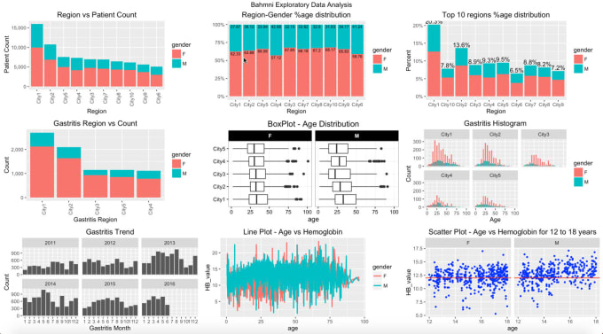

# Data-Analysis-Using-Python

This repo contain all my data analysis work completed by me for academic, self learning, and hobby purposes. Presented in the form of iPython Notebooks markdown files.

## Explainatory Data Analysis Using Python

 - Zomato Resturant Analysis (, ):
    - Analyzed over 9000 restaurants with over 20 features.
    - Performed data analysis using Python(pandas, numpy) and building visualizations using matplot lib and seaborn.
    - Identified best ‘Breakfast’, ‘Fast Food’ and ‘Ice Cream’ parlours in various localities.
	
  - Olympics Dataset Analysis (, ):
	  - Analyzed Olympics data from Athens 1896 to Rio 2016. The dataset contain over 2,70,000 records acorss 15 features. 
	  - I use python to run some data exploration techniques to provid my view of viewing the dataset like understand the impact of Height,Weight and Age in winning the medals, Women participaiton over the years...etc.
	  - Build intractive visuals using plotly. Also use seaborn and matplotlib for building visual.
	  - Perfomed analysis over best and worst performing counteris.
	  - Used python librairies seaborn and matplot lib.
	
  - Covid 19 Dataset(, ): 
  	- The analysis was perfomred over 47,000 records of daily covid data across 7 continents. The analysis was performed on 40 features.
  	- Libraries used - Matplotlib, Seaborn, plotly and Pandas.
  	- Analysed the trend of worst affected conteries and conturies having lowest death rate.
  	- Econnomic impact of Covid 19 worldwide.

My blogs on explainatory data analysis can be accessed here
  - [Exploratory Data Analysis of Zomato Restaurant data](https://blog.jovian.ai/explanatory-data-analysis-of-zomato-restaurant-data-71ba8c3c7e5e)
  - [Olympics Dataset Analysis](https://gurjeet333.medium.com/data-exploration-of-historical-olympics-dataset-2d50a7d0611d)
  - [Covid 19 Dataset](https://gurjeet333.medium.com/covid-19-explanatory-data-analysis-76cab46c48d1)
 
I also dabble in all other technology. You can access by complete portfolio [here](https://github.com/hargurjeet/Portfolio-Projects/blob/main/README.md)

If you liked what you saw, want to have a chat with me about the portfolio, work opportunities, or collaboration, shoot an email at gurjeet333@gmail.com
  
  
